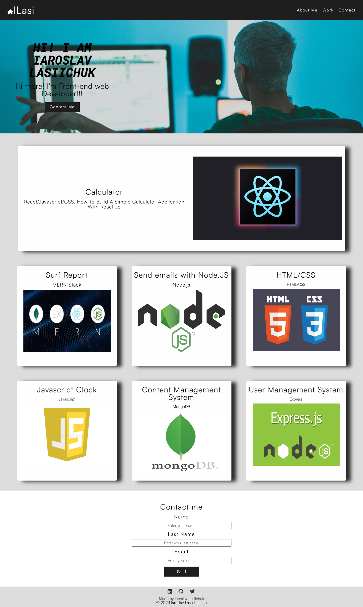

# Introduction
Welcome to the portfolio of Iaroslav Lasiichuk. This portfolio was designed to allow potential employers to easily view and access examples of Iaroslav Lasiichuk's previous work.

## Mock up

## Navigation
Upon loading the portfolio, you will be presented with the developer's name, a recent photo or avatar, and links to sections about them, their work, and how to contact them. You can navigate to these sections by clicking the corresponding links in the navigation.

## Work Section
In the "Work" section, you will find a list of titled images representing [Developer Name]'s various applications. The first application in the list will be displayed with a larger image size than the others. You can click on any of the images to be taken to the deployed application.

## Responsive Layout
This portfolio is designed to be responsive, meaning it will adapt to the size of your viewport and device. Whether you are viewing the site on a large desktop screen or a small mobile device, you should have a seamless experience.

## Contact
If you would like to contact Iaroslav Lasiichuk for potential employment or any other inquiries, please use the contact information provided in the "Contact" section of the portfolio or click [here](https://github.com/IaroslavLasiichuk/week1-challenge/blob/main/index.html). We look forward to hearing from you.
